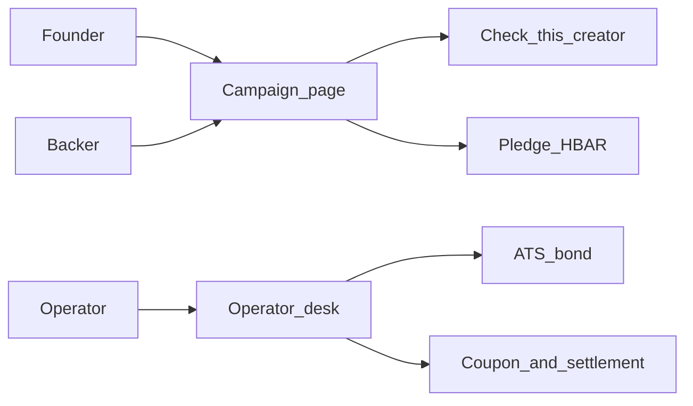
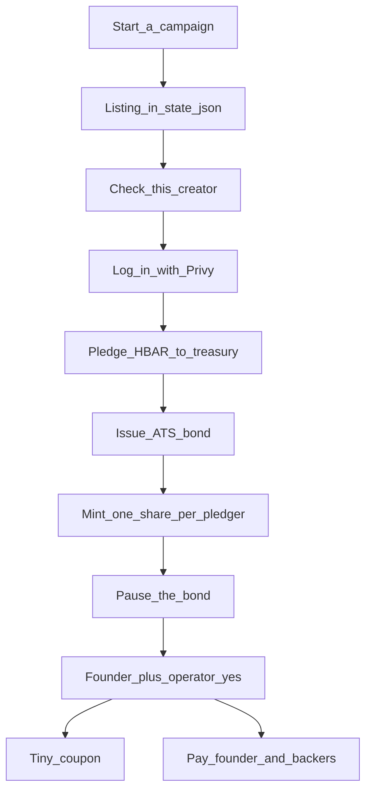
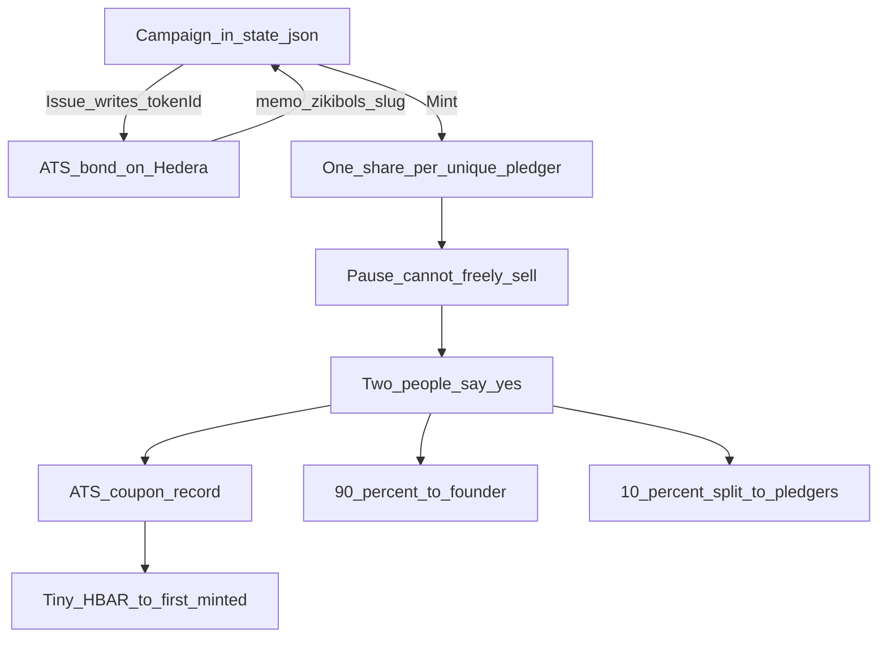

# How the app flows

This note is a **map**. It shows who does what, in what order, and where the campaign vs the ATS bond live.

The longer explainer is [readme-non-technical.md](./readme-non-technical.md). ATS in plain English: [readme-ats.md](./readme-ats.md). Check this creator: [readme-creator-lookup.md](./readme-creator-lookup.md). What the prototype can and cannot do: [readme-limitations.md](./readme-limitations.md). Technical README: [README.md](../README.md).

This is a **hackathon prototype** on Hedera testnet (play money).

---

## Big picture

Three people, two screens.



**The founder** writes a listing: who they are, the story, how much they want.

**The backer** reads that listing, can look the founder up, then sends a little play money.

**The operator** is the office after money is in. They print a locked receipt, freeze it, then send money out.

Two screens, two jobs:

- **Campaign page** = “I want to fund this.”
- **Operator desk** = “Print the certificate, lock it, pay people.”

---

## End to end

The whole product, top to bottom.



**Start a campaign** only creates a flyer on the website. No Hedera transaction. No bond yet.

**Check this creator** is the look-up before you send money. You can skip it with **Pledge anyway**.

**Pledge** is the real cash move: HBAR leaves the backer’s wallet and sits in **one treasury** (the office jar).

The ATS bond is **not** that money. It is a locked receipt printed later. The **tiny coupon** is a crumb to prove a payout button works. **Pay founder / Pay backers** is when the raise actually leaves the jar.

---

## Check this creator

The backer clicks once. The app’s robot does the work and pays the tiny fees.

```mermaid
flowchart TD
  click[Backer_clicks_Check] --> graph[The_Graph_three_lending_books]
  click --> search[Paid_founder_web_search]
  graph --> note[Paid_risk_note]
  search --> note
  note --> hcs[Hash_on_HCS]
  hcs --> ui[Show_profile_and_receipts]
```

**The Graph** is a free live look-up of three lending books (Aave, Compound, Spark) for the founder’s wallet.

**x402** is two tiny Hedera fees. The **app** pays them, not the backer: one for the web search, one for a written risk note.

**HCS** is a public fingerprint of that note (and the payment receipts) so nobody can quietly swap the text later.

Step-by-step of this click: [readme-creator-lookup.md](./readme-creator-lookup.md).

---

## Operator desk and the bond

The listing lives in the app. The bond lives on Hedera. They point at each other; they are not the same thing.

The desk is `/campaigns/<slug>/operate` — the office **after** money is in. Backers pledge on the campaign page. You do the rest here.

Two piles. Pledging only fills the cash pile.

| Pile | What it is | Where it sits |
|---|---|---|
| **Cash** | The HBAR people sent | One treasury wallet |
| **Certificate** | A locked ATS receipt / IOU | One bond contract on Hedera |



Button-by-button: [Issue bond and Mint share](./readme-ats.md#issue-bond-and-mint-share).

### 1. Issue bond

Prints **one blank form** for this campaign and registers it on Hedera. You get a contract id (`0.0.…`) and a HashScan link. The flyer stores that id as `tokenId` so the site knows “this listing’s IOU is that contract.”

**On the bond:** a name, a ticker, a short memo like `zikibols:harbor-credit`, plus dummy paperwork (fake ISIN, face value, dates). Not the pledged amount. Not the story.

**Does not:** give anyone a share, move HBAR, or need a pledger first. You can issue with an empty list. You can only issue **once**.

### 2. Mint share — once per unique pledger

The desk lists everyone who pledged (same wallet = one row, amounts added up). Each **Mint share** click:

1. Puts that wallet on the **allowed list** (only listed wallets can hold the IOU)
2. Hands them **1** unit of the **same** bond

A 13 ℏ pledge still mints **1** share, not 13. Alice 13 ℏ and Bob 50 ℏ each get 1 of the same IOU.

You can mint another pledger. The same wallet cannot be minted twice. After the first mint, status becomes **Transferred**. Each mint is saved in `runtime[slug].mints` with a HashScan tx.

**Mint to another address** is for a wallet that is not on the pledge list.

Mint does **not** create the bond (that was Issue) and does **not** pay anyone. The tiny coupon crumb later goes to the **first** minted address only.

### 3. Pause bond

One stamp on the **whole** bond: “cannot be freely sold.” Not per backer.

Mint already put each holder on the allowed list, so Pause does not add them again. After Pause, minting is closed.

### 4. Two people say yes

- **Approve as founder** — whoever is logged in with Privy (this demo does not check they are the real founder)
- **Co-sign as treasury** — the office / operator click

Both are stored flags on the desk, not a second on-chain key. Until both are yes, payout buttons stay off.

### 5. Money out (three different buttons)

| Button | What actually moves | Who gets it |
|---|---|---|
| **Release coupon** | A crumb (0.00001 ℏ) | First minted backer only |
| **Pay founder** | 90% of this campaign’s **live** pledges | Wallet on the listing |
| **Pay backers** | The other 10%, split by how much each pledged | Every pledger row |

**Pay founder / Pay backers** are ordinary treasury HBAR sends. They read `pledges` in `state.json`, not ATS share balances. Someone who pledged but never got a mint can still get their cut.

There is a cap (`PAYOUT_MAX_HBAR`) and a reserve the jar must keep for gas. Nothing checks that an invoice cleared or a crop sold — an operator decides it is time.

### Order

```
Issue bond  →  Mint share (each unique pledger)  →  Pause bond
        →  Approve as founder + Co-sign as treasury
        →  Release coupon  and/or  Pay founder  and/or  Pay backers
```

Issue first is the usual path. Mint cannot run before Issue. Mint cannot run after Pause.

ATS is the printer and the rulebook. The bond is the locked receipt. The HBAR is the cash. More on the workshop: [readme-ats.md](./readme-ats.md).

---

## Where things live

| Thing | Where | What it is |
|---|---|---|
| Campaign listing | `.data/state.json` | The flyer: story, goal, pledges, `tokenId` |
| Pledged HBAR | Treasury wallet on Hedera | The cash in the office jar |
| ATS bond | A contract on Hedera | The locked receipt / IOU |
| Check-this-creator note | Screen + optional HCS hash | The look-up, with a public fingerprint |

**On HashScan:** the pledge txs into the treasury, the bond contract, each mint, pause, and the payout txs.

**Only on the flyer** (`.data/state.json`): the story, the goal, the progress bar, which pledge belongs to which campaign, and who already got a unit. If you open HashScan with no app, you cannot see the Rotterdam story.
