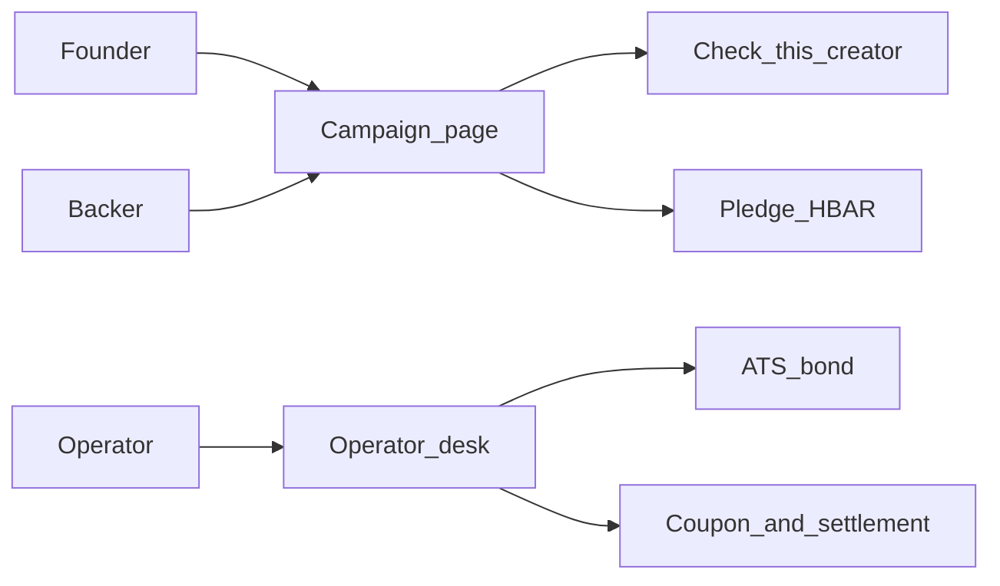
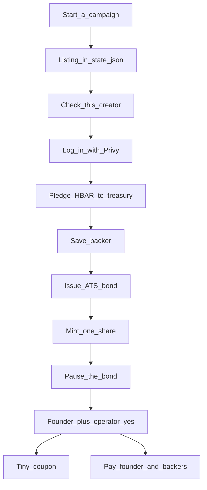

# How the app flows

This note is a **map**. It shows who does what, in what order, and where the campaign vs the ATS bond live.

The longer explainer is [readme-non-technical.md](./readme-non-technical.md). ATS in plain English: [readme-ats.md](./readme-ats.md). Check this creator: [readme-creator-lookup.md](./readme-creator-lookup.md). What the prototype can and cannot do: [readme-limitations.md](./readme-limitations.md). Technical README: [README.md](../README.md).

This is a **hackathon prototype** on Hedera testnet (play money).

---

## Big picture

Three people, two screens.



**The founder** writes a listing: who they are, the story, how much they want.

**The backer** reads that listing, can look the founder up, then sends a little play money.

**The operator** is the office after money is in. They print a locked receipt, freeze it, then send money out.

Two screens, two jobs:

- **Campaign page** = “I want to fund this.”
- **Operator desk** = “Print the certificate, lock it, pay people.”

---

## End to end

The whole product, top to bottom.



**Start a campaign** only creates a flyer on the website. No Hedera transaction. No bond yet.

**Check this creator** is the look-up before you send money. You can skip it with **Pledge anyway**.

**Pledge** is the real cash move: HBAR leaves the backer’s wallet and sits in **one treasury** (the office jar).

The ATS bond is **not** that money. It is a locked receipt printed later. The **tiny coupon** is a crumb to prove a payout button works. **Pay founder / Pay backers** is when the raise actually leaves the jar.

---

## Check this creator

The backer clicks once. The app’s robot does the work and pays the tiny fees.

```mermaid
flowchart TD
  click[Backer_clicks_Check] --> graph[The_Graph_three_lending_books]
  click --> search[Paid_founder_web_search]
  graph --> note[Paid_risk_note]
  search --> note
  note --> hcs[Hash_on_HCS]
  hcs --> ui[Show_profile_and_receipts]
```

**The Graph** is a free live look-up of three lending books (Aave, Compound, Spark) for the founder’s wallet.

**x402** is two tiny Hedera fees. The **app** pays them, not the backer: one for the web search, one for a written risk note.

**HCS** is a public fingerprint of that note (and the payment receipts) so nobody can quietly swap the text later.

Step-by-step of this click: [readme-creator-lookup.md](./readme-creator-lookup.md).

---

## Operator desk and the bond

The listing lives in the app. The bond lives on Hedera. They point at each other; they are not the same thing.


**Issue** prints the official certificate and saves its contract id (`tokenId`) on the campaign. That is how the app knows “this listing’s bond is that contract.” What the two buttons do, in the same voice: [Issue bond and Mint share](./readme-ats.md#issue-bond-and-mint-share).

**What is on the bond:** a name, a ticker, and a short memo like `zikibols:harbor-credit`. Plus dummy bond paperwork (a fake ISIN, a face value, dates). Not the pledged amount. Not the story.

**What stays in `.data/state.json`:** the flyer, who pledged how much, who already got a unit (`mints`), and that `tokenId` pointer.

**Mint** gives **one** share to each unique pledger you click. **Pause** stamps “cannot be freely sold.”

After **two people say yes** (founder + operator):

- ATS writes “a coupon is due,” then the app sends a **crumb** of HBAR to that one backer.
- **Pay founder** sends most of this listing’s raise to the founder’s wallet.
- **Pay backers** splits the rest across everyone who pledged.

ATS is the printer and the rulebook. The bond is the locked receipt. The HBAR is the cash. More on the workshop: [readme-ats.md](./readme-ats.md).

---

## Where things live

| Thing | Where | What it is |
|---|---|---|
| Campaign listing | `.data/state.json` | The flyer: story, goal, pledges, `tokenId` |
| Pledged HBAR | Treasury wallet on Hedera | The cash in the office jar |
| ATS bond | A contract on Hedera | The locked receipt / IOU |
| Check-this-creator note | Screen + optional HCS hash | The look-up, with a public fingerprint |

If you open HashScan with no app, you can see the pledge, the bond, and the payouts. You cannot see the Rotterdam story or the progress bar. Those are only in the flyer.
